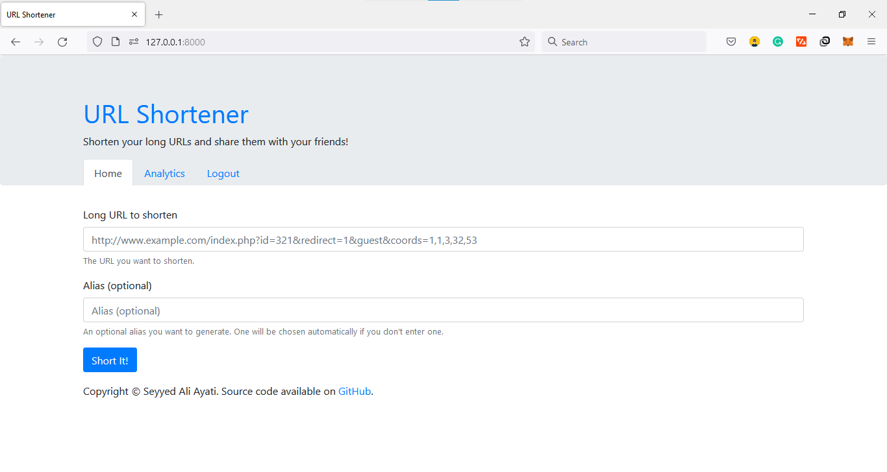
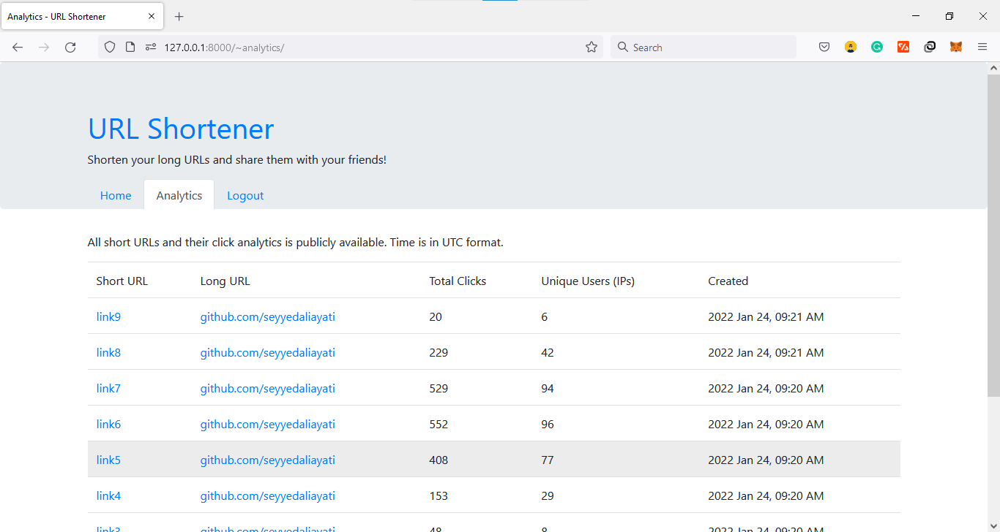
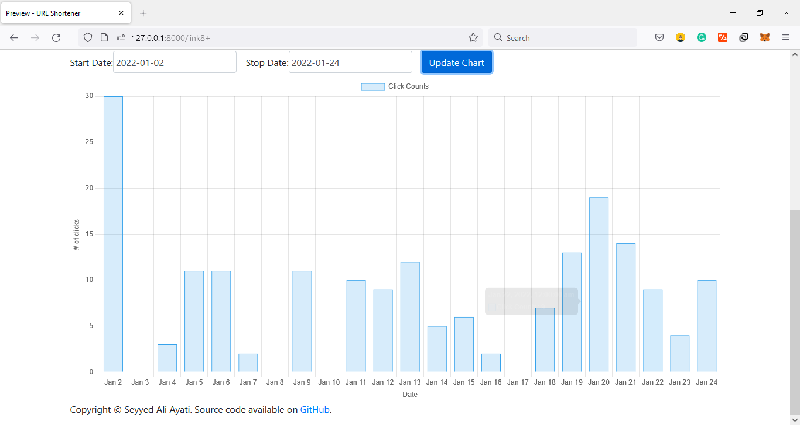

# Django URL Shortener
This project is just a complete and production-ready URL shortener web application to show off my tech and coding abilities.

# Important Note
Since this is a demo project, I committed `.env` files. **Please never commit important configs**

## Features
- Users can login with email and password.
- Forms can be protected by Google ReCaptcha. (For example register form in this project)
- Users can shorten their long urls.
- Users can have their customized short url by setting alias.
- Users can monitor some analytics in their dashboard. (total clicks and unique clicks)
- Users can edit their URLs.
- Users can delete their URLs.

## Used Technologies
- Python Programming Language
- Django Web Framework
- Docker and Docker Compose
- Nginx and Gunicorn
- PostgresQL
- HTML, CSS, and Bootstrap v4
- JavaScript and jQuery
- ChartJS

## Used Techniques
- Class Based Views
- Pagination
- Separated configs for production and development

## Used Third-Party Libraries
- hashids
- django-bootstrap4
- django-recaptcha


## Screenshots
 





## Useful Docker Commands
Here are some code snippets related to setting up this project.

### Building
Development:
```bash
sudo docker-compose -f docker-compose.yml --build -d
```
Production:
```bash
sudo docker-compose -f docker-compose.prod.yml --build -d
```
### Following Logs
Development:
```bash
sudo docker-compose -f docker-compose.yml logs -f
```
Production:
```bash
sudo docker-compose -f docker-compose.prod.yml logs -f
```
### Migration
In development migration are applied automatically in `entrypoint.sh`.

Production:
```bash
sudo docker-compose -f docker-compose.prod.yml exec web python manage.py migrate
```
### Collect Static Files
In development there is no need to collect static files!

Production:
```bash
sudo docker-compose -f docker-compose.prod.yml exec web python manage.py collectstatic --noinput --clear
```
### Fill Database with Fake Data
**For demo purposes only**
In development database is filled automatically in `entrypoint.sh`.

Production:
```bash
sudo docker-compose -f docker-compose.prod.yml exec web python manage.py fill_db
```

After executing this command and admin user will created for you:

- **Email:** admin@admin.com
- **Password:** admin

## Future Works
- Add user email verification.
- Protect login with reCaptcha.
- Support other languages.
- Add caching (redis).
- Load tests.
- More unit tests.

# Thanks for your attention!
Feel free to create issues, pull requests or even contact me (seyyedaliayati@gmail.com)!

